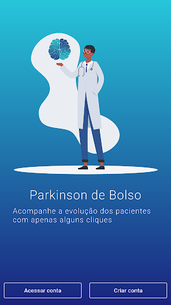
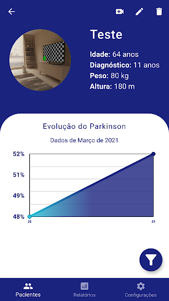
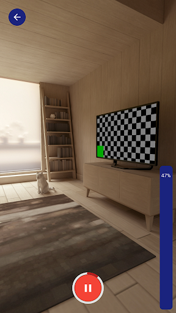

# Pocket Parkinson's - Application

 Final work of the Bachelor of Science in Computer Science at the Regional University of Blumenau - FURB. 

 Application to assist in monitoring the evolution of Parkinson's disease. 

**Demonstrative images of the APP**

